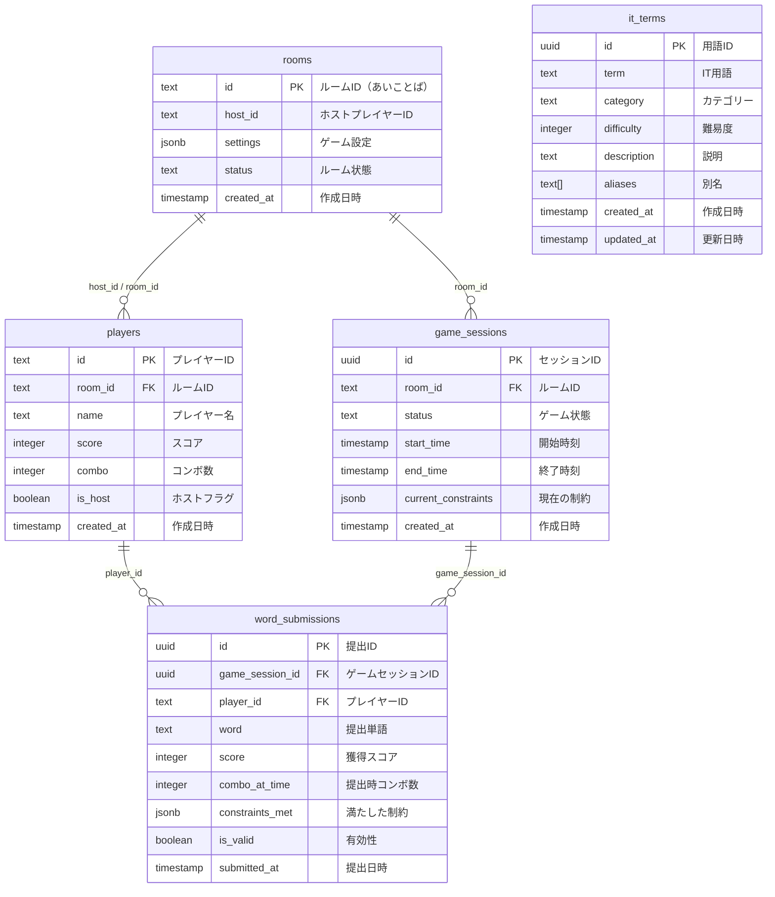

# データベース設計書
## TYPE 2 LIVE - PostgreSQL Schema

### 📊 **テーブル一覧**



---

## 🏗️ **テーブル定義**

### 1. rooms（ルーム管理）
```sql
create table public.rooms (
  id text primary key,                    -- ルームID（あいことば）
  host_id text not null,                  -- ホストプレイヤーID
  settings jsonb not null default '{}',   -- ゲーム設定
  status text not null default 'waiting', -- ルーム状態
  created_at timestamp with time zone default timezone('utc'::text, now()) not null,
  
  -- 制約
  constraint rooms_status_check check (status in ('waiting', 'playing', 'finished'))
);
```

#### **settings JSON構造**
```json
{
  "timeLimit": 5,        // 制限時間（分）
  "maxPlayers": 4,       // 最大参加人数
  "category": "all"      // カテゴリー
}
```

#### **カテゴリー一覧**
- `all` - 全分野
- `web` - Web開発
- `database` - データベース  
- `ai` - AI・機械学習
- `security` - セキュリティ
- `infrastructure` - インフラ・クラウド
- `programming` - プログラミング言語

---

### 2. players（プレイヤー管理）
```sql
create table public.players (
  id text primary key,                    -- プレイヤーID（UUID）
  room_id text not null,                  -- 所属ルームID
  name text not null,                     -- プレイヤー名
  score integer not null default 0,       -- 現在のスコア
  combo integer not null default 0,       -- 現在のコンボ数
  is_host boolean not null default false, -- ホストフラグ
  created_at timestamp with time zone default timezone('utc'::text, now()) not null,
  
  -- 外部キー
  constraint players_room_id_fkey foreign key (room_id) references public.rooms(id) on delete cascade,
  
  -- 制約
  constraint players_score_check check (score >= 0),
  constraint players_combo_check check (combo >= 0),
  constraint players_name_length check (char_length(name) between 1 and 15)
);
```

---

### 3. game_sessions（ゲームセッション管理）
```sql
create table public.game_sessions (
  id uuid default gen_random_uuid() primary key, -- セッションID
  room_id text not null,                          -- 対象ルームID
  status text not null default 'waiting',         -- ゲーム状態
  start_time timestamp with time zone,            -- 開始時刻
  end_time timestamp with time zone,              -- 終了時刻
  current_constraints jsonb default '[]',         -- 現在の制約条件
  created_at timestamp with time zone default timezone('utc'::text, now()) not null,
  
  -- 外部キー
  constraint game_sessions_room_id_fkey foreign key (room_id) references public.rooms(id) on delete cascade,
  
  -- 制約
  constraint game_sessions_status_check check (status in ('waiting', 'playing', 'finished')),
  constraint game_sessions_time_check check (start_time is null or end_time is null or start_time <= end_time)
);
```

#### **current_constraints JSON構造**
```json
[
  {
    "type": "letter",           // 制約タイプ
    "condition": "contains",    // 条件
    "value": "a",              // 値
    "coefficient": 2           // 難易度係数
  },
  {
    "type": "category",
    "condition": "equals",
    "value": "web",
    "coefficient": 3
  }
]
```

---

### 4. word_submissions（単語提出履歴）
```sql
create table public.word_submissions (
  id uuid default gen_random_uuid() primary key,     -- 提出ID
  game_session_id uuid not null,                     -- ゲームセッションID
  player_id text not null,                           -- プレイヤーID
  word text not null,                                -- 提出単語
  score integer not null,                            -- 獲得スコア
  combo_at_time integer not null default 0,          -- 提出時のコンボ数
  constraints_met jsonb default '[]',                -- 満たした制約
  is_valid boolean not null,                         -- 有効性
  submitted_at timestamp with time zone default timezone('utc'::text, now()) not null,
  
  -- 外部キー
  constraint word_submissions_game_session_id_fkey foreign key (game_session_id) references public.game_sessions(id) on delete cascade,
  constraint word_submissions_player_id_fkey foreign key (player_id) references public.players(id) on delete cascade,
  
  -- 制約
  constraint word_submissions_score_check check (score >= 0),
  constraint word_submissions_combo_check check (combo_at_time >= 0),
  constraint word_submissions_word_length check (char_length(word) >= 1)
);
```

---

### 5. it_terms（IT用語辞書）
```sql
create table public.it_terms (
  id uuid default gen_random_uuid() primary key, -- 用語ID
  term text not null unique,                     -- IT用語
  category text not null,                        -- カテゴリー
  difficulty integer not null,                   -- 難易度（1-10）
  description text,                              -- 説明
  aliases text[] default '{}',                   -- 別名・表記ゆれ
  created_at timestamp with time zone default timezone('utc'::text, now()) not null,
  updated_at timestamp with time zone default timezone('utc'::text, now()) not null,
  
  -- 制約
  constraint it_terms_difficulty_check check (difficulty between 1 and 10),
  constraint it_terms_category_check check (category in ('web', 'database', 'ai', 'security', 'infrastructure', 'programming', 'other')),
  constraint it_terms_term_length check (char_length(term) between 1 and 50)
);
```

#### **IT用語の例**
```sql
insert into public.it_terms (term, category, difficulty, description) values
('TypeScript', 'programming', 3, 'JavaScriptに型安全性を追加した言語'),
('React', 'web', 4, 'Facebookが開発したJavaScriptライブラリ'),
('PostgreSQL', 'database', 6, 'オープンソースのリレーショナルデータベース'),
('Docker', 'infrastructure', 7, 'コンテナ仮想化プラットフォーム'),
('OAuth', 'security', 8, '認証・認可のオープン標準'),
('TensorFlow', 'ai', 9, 'Googleが開発した機械学習ライブラリ');
```

---

## 🔧 **インデックス設計**

### パフォーマンス最適化用インデックス
```sql
-- プレイヤー検索用
create index idx_players_room_id on public.players(room_id);
create index idx_players_host on public.players(room_id, is_host) where is_host = true;

-- ゲームセッション検索用
create index idx_game_sessions_room_id on public.game_sessions(room_id);
create index idx_game_sessions_status on public.game_sessions(status);
create index idx_game_sessions_active on public.game_sessions(room_id, status) where status = 'playing';

-- 単語提出検索用
create index idx_word_submissions_game_session_id on public.word_submissions(game_session_id);
create index idx_word_submissions_player_id on public.word_submissions(player_id);
create index idx_word_submissions_game_player on public.word_submissions(game_session_id, player_id);

-- IT用語検索用
create index idx_it_terms_category on public.it_terms(category);
create index idx_it_terms_difficulty on public.it_terms(difficulty);
create index idx_it_terms_term_trgm on public.it_terms using gin (term gin_trgm_ops);
```

---

## 🔐 **Row Level Security (RLS)**

### 基本ポリシー（開発用）
```sql
-- 全テーブルでRLSを有効化
alter table public.rooms enable row level security;
alter table public.players enable row level security;
alter table public.game_sessions enable row level security;
alter table public.word_submissions enable row level security;
alter table public.it_terms enable row level security;

-- 開発用：全操作許可
create policy "Allow all operations on rooms" on public.rooms for all using (true);
create policy "Allow all operations on players" on public.players for all using (true);
create policy "Allow all operations on game_sessions" on public.game_sessions for all using (true);
create policy "Allow all operations on word_submissions" on public.word_submissions for all using (true);
create policy "Allow all operations on it_terms" on public.it_terms for all using (true);
```

### 本番用セキュリティポリシー
```sql
-- rooms: 閲覧は全員、作成は全員、更新はホストのみ
create policy "Anyone can view rooms" on public.rooms for select using (true);
create policy "Anyone can create rooms" on public.rooms for insert with check (true);
create policy "Host can update rooms" on public.rooms for update using (auth.uid()::text = host_id);
create policy "Host can delete rooms" on public.rooms for delete using (auth.uid()::text = host_id);

-- players: 閲覧は全員、作成は全員、更新・削除は本人のみ
create policy "Anyone can view players" on public.players for select using (true);
create policy "Anyone can create players" on public.players for insert with check (true);
create policy "Players can update themselves" on public.players for update using (auth.uid()::text = id);
create policy "Players can delete themselves" on public.players for delete using (auth.uid()::text = id);

-- it_terms: 閲覧は全員、更新は管理者のみ
create policy "Anyone can view it_terms" on public.it_terms for select using (true);
```

---

## 📡 **Realtime設定**

### Realtimeでリアルタイム更新するテーブル
```sql
-- Realtime Publicationに追加
alter publication supabase_realtime add table public.rooms;
alter publication supabase_realtime add table public.players;
alter publication supabase_realtime add table public.game_sessions;
alter publication supabase_realtime add table public.word_submissions;
```

### 監視対象イベント
- `rooms`: ステータス変更（waiting → playing → finished）
- `players`: 参加・退出、スコア・コンボ更新
- `game_sessions`: ゲーム開始・終了
- `word_submissions`: 単語提出（リアルタイムスコア更新用）

---

## 🔄 **データライフサイクル**

### 1. ルーム作成フロー
```sql
-- 1. ルーム作成
insert into rooms (id, host_id, settings) values ('abc123', 'user1', '{"timeLimit": 5}');

-- 2. ホストプレイヤー追加
insert into players (id, room_id, name, is_host) values ('user1', 'abc123', 'ホスト', true);
```

### 2. ゲーム開始フロー
```sql
-- 1. ルーム状態をプレイ中に変更
update rooms set status = 'playing' where id = 'abc123';

-- 2. ゲームセッション作成
insert into game_sessions (room_id, status, start_time) 
values ('abc123', 'playing', now());
```

### 3. 単語提出フロー
```sql
-- 1. 単語提出記録
insert into word_submissions (game_session_id, player_id, word, score, is_valid)
values ('session-uuid', 'user1', 'typescript', 50, true);

-- 2. プレイヤースコア・コンボ更新
update players 
set score = score + 50, combo = combo + 1
where id = 'user1';
```

---

## 📈 **統計・分析用ビュー**

### ゲーム統計ビュー
```sql
create view game_statistics as
select 
  r.id as room_id,
  r.created_at as game_date,
  jsonb_extract_path_text(r.settings, 'timeLimit')::integer as time_limit,
  count(p.id) as player_count,
  max(p.score) as max_score,
  avg(p.score) as avg_score,
  count(ws.id) as total_words_submitted,
  count(case when ws.is_valid then 1 end) as valid_words_count
from rooms r
left join players p on r.id = p.room_id
left join game_sessions gs on r.id = gs.room_id
left join word_submissions ws on gs.id = ws.game_session_id
where r.status = 'finished'
group by r.id, r.created_at, r.settings;
```

### プレイヤー統計ビュー
```sql
create view player_statistics as
select 
  p.name,
  count(distinct p.room_id) as games_played,
  avg(p.score) as avg_score,
  max(p.score) as best_score,
  max(p.combo) as best_combo,
  count(ws.id) as total_words,
  count(case when ws.is_valid then 1 end) as valid_words,
  round(count(case when ws.is_valid then 1 end)::numeric / nullif(count(ws.id), 0) * 100, 2) as accuracy_rate
from players p
left join game_sessions gs on p.room_id = gs.room_id
left join word_submissions ws on gs.id = ws.game_session_id and p.id = ws.player_id
group by p.name;
```

---

## 🧪 **テストデータ**

### サンプルデータ投入
```sql
-- IT用語サンプル
insert into it_terms (term, category, difficulty, description) values
('HTML', 'web', 1, 'ウェブページの構造を記述するマークアップ言語'),
('CSS', 'web', 2, 'ウェブページのスタイルを定義する言語'),
('JavaScript', 'web', 3, 'ウェブ開発で広く使われるプログラミング言語'),
('React', 'web', 4, 'ユーザーインターフェース構築用JavaScriptライブラリ'),
('Node.js', 'web', 5, 'サーバーサイドJavaScript実行環境'),
('SQL', 'database', 3, '構造化問い合わせ言語'),
('MySQL', 'database', 4, 'オープンソースのリレーショナルデータベース'),
('MongoDB', 'database', 5, 'NoSQLドキュメントデータベース'),
('Redis', 'database', 6, 'インメモリデータストア'),
('Python', 'programming', 3, '汎用プログラミング言語'),
('Java', 'programming', 4, 'オブジェクト指向プログラミング言語'),
('Go', 'programming', 6, 'Googleが開発したプログラミング言語'),
('Rust', 'programming', 8, 'システムプログラミング向け言語'),
('Docker', 'infrastructure', 6, 'コンテナ化プラットフォーム'),
('Kubernetes', 'infrastructure', 9, 'コンテナオーケストレーション'),
('AWS', 'infrastructure', 5, 'Amazonのクラウドサービス'),
('OAuth', 'security', 7, '認証・認可のオープン標準'),
('JWT', 'security', 6, 'JSON Web Token'),
('SSL', 'security', 5, 'Secure Sockets Layer'),
('TensorFlow', 'ai', 8, 'Googleの機械学習ライブラリ'),
('PyTorch', 'ai', 8, 'Facebookの機械学習ライブラリ'),
('pandas', 'ai', 6, 'Pythonデータ分析ライブラリ'),
('NumPy', 'ai', 5, 'Python数値計算ライブラリ');
```

がんばルビィ！これでデータベース設計が完璧に整理されたルビィ～✨
