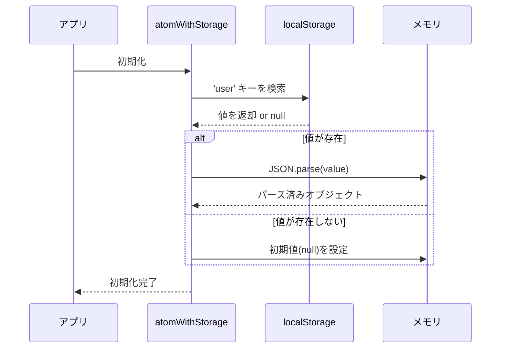
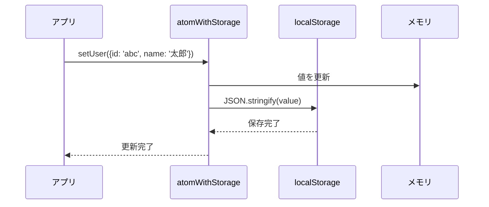

# Jotai 状態管理と永続化の詳細解説

## 📅 作成日
2025年6月18日

## 🎯 目的
Jotaiの状態管理、永続化の仕組み、データ保存場所について詳細に解説する

## 🔍 永続化とは何か？

### 1. 通常のJotai Atom（永続化なし）
```typescript
const userAtom = atom<User | null>(null)
```

#### 特徴
- **保存場所**: JavaScript実行環境のメモリ（RAM）
- **データ形式**: JavaScript オブジェクト
- **生存期間**: ページ読み込み〜ページ閉じるまで
- **リロード時**: 初期値にリセット
- **タブ間共有**: 不可能

#### メモリ内での動作
```
┌─────────────────┐
│ Browser Memory  │
│ ┌─────────────┐ │
│ │ Jotai Store │ │
│ │ userAtom: {} │ │  ← ここに保存
│ └─────────────┘ │
└─────────────────┘
```

### 2. atomWithStorage（永続化あり）
```typescript
const userAtom = atomWithStorage<User | null>('user', null)
```

#### 特徴
- **保存場所**: ブラウザのlocalStorage + メモリ
- **データ形式**: JSON文字列（localStorage）+ JavaScript オブジェクト（メモリ）
- **生存期間**: ユーザーが明示的に削除するまで
- **リロード時**: localStorageから自動復元
- **タブ間共有**: 可能（同一オリジン）

#### 二重保存の仕組み
```
┌─────────────────┐    ┌──────────────────┐
│ Browser Memory  │    │ Browser Storage  │
│ ┌─────────────┐ │    │ ┌──────────────┐ │
│ │ Jotai Store │ │◄──►│ │ localStorage │ │
│ │ userAtom: {} │ │    │ │ 'user': '{}' │ │
│ └─────────────┘ │    │ └──────────────┘ │
└─────────────────┘    └──────────────────┘
```

## 🏠 データの物理的保存場所

### localStorage の実際の場所

#### Chrome/Chromium系
```
Linux: ~/.config/google-chrome/Default/Local Storage/
Windows: %LOCALAPPDATA%\Google\Chrome\User Data\Default\Local Storage\
macOS: ~/Library/Application Support/Google/Chrome/Default/Local Storage/
```

#### Firefox
```
Linux: ~/.mozilla/firefox/[profile]/webappsstore.sqlite
Windows: %APPDATA%\Mozilla\Firefox\Profiles\[profile]\webappsstore.sqlite
macOS: ~/Library/Application Support/Firefox/Profiles/[profile]/webappsstore.sqlite
```

### データの保存形式
```javascript
// localStorage内での実際のデータ
{
  "user": "{\"id\":\"abc123\",\"name\":\"太郎\"}"
}
```

## 🔄 atomWithStorage の動作フロー

### 初期化時


### 値の更新時


## 🐛 問題の原因分析

### 現在のアプリでの状況

1. **実装済み**: `userAtom` は `atomWithStorage` に変更済み
2. **想定される問題**: 
   - 初回アクセス時は localStorage が空
   - `/menu` への直接アクセス時にリダイレクトが発生

### 問題のシナリオ
```
1. ユーザーがブラウザを開く
2. localStorage['user'] = undefined
3. userAtom = null (初期値)
4. /menu にアクセス
5. useEffect で user === null をチェック
6. / にリダイレクト
```

## 💡 解決策の効果

### Before（atom使用）
```typescript
const userAtom = atom<User | null>(null)
// ページリロード → 必ず null にリセット → リダイレクト
```

### After（atomWithStorage使用）
```typescript
const userAtom = atomWithStorage<User | null>('user', null)
// ページリロード → localStorage から復元 → リダイレクトなし
```

## 🧪 動作確認の手順

1. **ニックネーム入力**
   ```javascript
   // ブラウザの開発者ツールで確認
   localStorage.getItem('user')
   // → "{\"id\":\"...\",\"name\":\"入力した名前\"}"
   ```

2. **ページリロード**
   ```javascript
   // リロード後も値が保持されている
   localStorage.getItem('user')
   // → 同じ値が返される
   ```

3. **タブ間共有**
   ```javascript
   // 別タブでも同じ値が見える
   window.addEventListener('storage', (e) => {
     console.log('他のタブで変更:', e.newValue)
   })
   ```

## 📊 パフォーマンスへの影響

### メモリ使用量
- **増加**: 微増（JSON文字列のパース処理）
- **影響**: 無視できるレベル

### ストレージ使用量
- **使用量**: 数KB〜数十KB（ユーザーデータ）
- **上限**: 5-10MB（ブラウザ依存）

## 🔒 セキュリティ考慮事項

### localStorage の制限
- **オリジン別**: 同一オリジンでのみアクセス可能
- **暗号化**: なし（平文で保存）
- **有効期限**: なし（手動削除まで永続）

### 注意点
- 機密情報は保存しない
- XSS攻撃でアクセスされる可能性
- ユーザーが意図的に削除可能

## 🎯 まとめ

atomWithStorage により：
- ✅ ページリロード時の状態保持
- ✅ タブ間での状態共有  
- ✅ ユーザー体験の向上
- ✅ 不要なリダイレクトの防止

永続化により、メモリ内の一時的な状態から、ブラウザストレージを活用した永続的な状態管理に移行できた。
