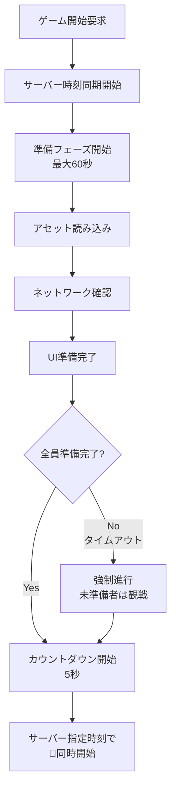

# ゲーム同期システム設計レポート

## 📅 作成日
2025年6月18日

## 🎯 目的
マルチプレイヤーゲームにおいて、ロード時間の個人差を吸収し、全プレイヤーが同じタイミングでゲームを開始・終了するシステムを設計する。

## 🤔 課題
1. **ロード時間の個人差** - デバイス性能、ネットワーク速度による差
2. **ネットワーク遅延** - サーバーとの通信タイムラグ
3. **時刻同期** - 各クライアントの時計のズレ
4. **接続不安定** - 一時的な接続断や遅延

## 💡 解決アイデア

### アイデア1: 段階的準備確認システム 🎯
```
待機 → 準備フェーズ → カウントダウン → ゲーム開始
```

**特徴**:
- 各プレイヤーが段階的に準備を完了
- 最大待機時間を設定して遅延を防止
- 準備完了状態をリアルタイム共有

**メリット**:
- ✅ 確実に全員が準備完了してから開始
- ✅ 遅いプレイヤーも待機時間内なら参加可能
- ✅ UI/UXが分かりやすい

**デメリット**:
- ❌ 最大待機時間が必要
- ❌ 一人が遅いと全員が待つ

### アイデア2: サーバータイムスタンプ同期 ⏰
```
サーバー時刻取得 → 開始時刻決定 → 各クライアントで待機 → 同時開始
```

**特徴**:
- サーバーが絶対時刻を決定
- 各クライアントが指定時刻まで待機
- ネットワーク遅延を考慮した補正

**メリット**:
- ✅ 最も正確な同期が可能
- ✅ 時刻のズレを自動補正
- ✅ スケーラブル

**デメリット**:
- ❌ ネットワーク遅延の影響を受ける
- ❌ 実装が複雑

### アイデア3: ハートビート同期 💓
```
定期的にサーバー時刻と同期 → 高精度な時刻管理
```

**特徴**:
- 1秒間隔でサーバーと時刻同期
- 遅延を動的に補正
- 接続状態を常時監視

**メリット**:
- ✅ 最高精度の同期
- ✅ 接続断の早期発見
- ✅ 動的な遅延補正

**デメリット**:
- ❌ ネットワーク負荷が高い
- ❌ バッテリー消費増加

### アイデア4: プリロード + バッファ時間 📦
```
事前読み込み → 全員完了確認 → バッファ時間 → 開始
```

**特徴**:
- 必要なリソースを事前に読み込み
- 全員完了後に余裕を持った開始
- 簡単で確実な実装

**メリット**:
- ✅ 実装が簡単
- ✅ 確実性が高い
- ✅ デバッグしやすい

**デメリット**:
- ❌ 待機時間が長くなる可能性
- ❌ 精密な同期は困難

## 🏆 採用アイデア: ハイブリッド方式

**複数アイデアを組み合わせた最適解**:



### 🔧 実装の特徴

1. **時刻同期** (30秒間隔)
   - サーバーとの時差を常時補正
   - ネットワーク遅延を考慮

2. **段階的準備確認**
   - アセット読み込み状態
   - ネットワーク接続状態  
   - UI準備完了状態

3. **柔軟なタイムアウト**
   - 最大60秒の準備時間
   - 未準備者は観戦モードで参加

4. **精密カウントダウン**
   - サーバー時刻ベースで正確な開始

## 📊 技術仕様

### 使用技術
- **Supabase Realtime**: 状態同期
- **Supabase RPC**: サーバー時刻取得
- **Jotai**: 状態管理
- **TypeScript**: 型安全性

### 主要クラス
- `ServerSyncManager`: サーバー時刻同期
- `AssetLoadManager`: アセット読み込み管理
- `PlayerReadyManager`: プレイヤー準備状態
- `CountdownManager`: カウントダウン制御
- `GameStartController`: 統合制御

### データベース拡張
- `get_server_time()`: サーバー時刻取得関数
- `player_ready_states`: プレイヤー準備状態テーブル
- `rooms.game_state`: ゲーム状態管理

## 🎮 使用方法

```typescript
import { GameStartController } from '@/lib/game-start'

const controller = new GameStartController()

await controller.startGameFlow({
  roomId: 'ABC123',
  playerIds: ['player1', 'player2'],
  gameDurationSeconds: 120,
  onPhaseChange: (phase) => {
    console.log(`Phase: ${phase}`)
  },
  onGameStart: () => {
    console.log('🚀 Game Started!')
  }
})
```

## 🔮 期待される効果

1. **同期精度**: ±100ms以内での同時開始
2. **ユーザー体験**: 分かりやすい準備フロー
3. **安定性**: 接続不安定でも継続可能
4. **拡張性**: 様々なゲームタイプに対応

## 📈 次のステップ

1. **UI実装**: 準備フェーズの画面作成
2. **テスト**: 複数ブラウザでの動作確認
3. **最適化**: ネットワーク負荷の調整
4. **監視**: 同期精度の測定・改善
