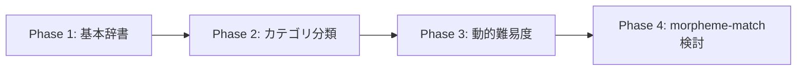

# morpheme-match 必要性分析レポート 🔍💭

## 結論: **現時点では不要、将来的には有用** ⚖️

### 現在のサービス要件との比較分析

#### ✅ 現在の要件（シンプル設計）
```
- 指定文字を含むIT用語の入力
- 辞書との照合による正誤判定  
- 文字数 × 難易度 × 制約係数 × コンボのスコア計算
- リアルタイムマルチプレイヤー体験
```

#### 🤔 morpheme-matchで可能になること
```
- 品詞レベルでの詳細解析
- 複合語・派生語の適切な処理
- 専門分野カテゴリの自動判別
- 形態素解析に基づく高度な検証
```

## 📊 必要性評価マトリックス

| 要素 | 現在の必要度 | 将来の価値 | 実装コスト | 総合判定 |
|------|-------------|-----------|------------|----------|
| **基本ゲーム体験** | ❌ 不要 | ⭐⭐ | 高 | 🔺 保留 |
| **単語検証の精度** | ❌ 不要 | ⭐⭐⭐ | 中 | 🔺 保留 |
| **専門性判定** | ❌ 不要 | ⭐⭐⭐⭐ | 中 | ✅ 有用 |
| **学習・教育機能** | ❌ 不要 | ⭐⭐⭐⭐⭐ | 高 | ✅ 有用 |

## 🚫 現時点で不要な理由

### 1. オーバーエンジニアリングのリスク
```typescript
// 現在必要なのは：シンプルな辞書照合
const isValidWord = (word: string) => {
  return dictionary.includes(word.toLowerCase());
};

// morpheme-matchを使うと：複雑すぎる処理
const analyzer = new MorphemeAnalyzer();
const result = await analyzer.analyzeWord(word);
// 3倍以上のコード量、処理時間も増加
```

### 2. パフォーマンスの懸念 ⚡
- **現在**: 辞書検索 < 1ms
- **morpheme-match**: 形態素解析 10-50ms
- **リアルタイムゲーム**: 100ms以内の要件に影響可能

### 3. 複雑性の増加 📈
```diff
# 現在のシンプルな構成
- IT用語辞書 (JSON/CSV)
- 基本的な文字列マッチング
- 軽量で高速

# morpheme-match導入後
+ kuromojin (2.5MB)
+ morpheme-match (18.5KB)  
+ 複雑な辞書設計
+ 非同期処理の管理
+ エラーハンドリングの複雑化
```

### 4. MVP原則との不整合 🎯
```
MVP (Minimum Viable Product) では：
✅ 核心機能：リアルタイムタイピングゲーム
✅ 基本検証：IT用語かどうかの判定
❌ 高度解析：品詞・専門性・複合語解析
```

## 🎯 代替案：シンプルで効果的なアプローチ

### 1. カテゴリ分類辞書の活用
```typescript
// シンプルで十分効果的
const itTermsWithCategory = {
  "javascript": { category: "programming", difficulty: 2 },
  "database": { category: "database", difficulty: 3 },
  "docker": { category: "devops", difficulty: 4 }
};

const validateWord = (word: string) => {
  const term = itTermsWithCategory[word.toLowerCase()];
  return {
    valid: !!term,
    category: term?.category,
    difficulty: term?.difficulty,
    bonusPoints: calculateBonus(term)
  };
};
```

### 2. 段階的アプローチ（推奨）


## ✅ 将来的に有用になる場面

### 1. 教育機能の拡張 📚
```typescript
// 単語の詳細解析・説明機能
const explainWord = async (word: string) => {
  const analysis = await analyzer.analyzeWord(word);
  return {
    definition: getDefinition(word),
    morphology: analysis.tokens,
    relatedTerms: findRelatedTerms(analysis),
    difficulty: calculateEducationalDifficulty(analysis)
  };
};
```

### 2. 高度なゲームモード 🎮
```typescript
// 「品詞指定モード」「複合語チャレンジ」等
const advancedModes = {
  partOfSpeechChallenge: "名詞のみ",
  compoundWordMode: "複合語のみ",
  morphologyQuiz: "語幹・活用形当て"
};
```

### 3. ユーザー投稿システム 👥
```typescript
// ユーザーが投稿した用語の自動検証
const validateUserSubmission = async (word: string) => {
  const analysis = await analyzer.analyzeWord(word);
  return {
    isITTerm: checkITTermLikelihood(analysis),
    suggestedCategory: inferCategory(analysis),
    needsReview: analysis.confidence < 0.8
  };
};
```

## 🚀 推奨アクション

### 現在（Priority 1）
1. **基本辞書システムの完成** 📝
   - IT用語のJSONファイル作成
   - カテゴリ・難易度の手動設定
   - シンプルで高速な検索システム

2. **ゲーム体験の最適化** 🎯
   - リアルタイム性能の向上
   - UI/UXの改善
   - バグ修正・安定性確保

### 将来（Priority 2-3）
3. **教育機能の検討** 📚
   - ユーザー学習データの分析
   - 単語解説・関連情報機能
   - この段階でmorpheme-match検討

4. **高度なゲームモード** 🎮
   - ユーザーの習熟度向上後
   - より複雑なルールへの需要確認
   - morpheme-matchの本格活用

## 💡 結論と提案

### ❌ 今すぐ導入しない理由
- オーバーエンジニアリング
- パフォーマンスリスク  
- 開発工数の無駄
- MVP原則との不整合

### ✅ 今やるべきこと
- 基本ゲーム機能の完成度向上
- シンプルな辞書システムの構築
- ユーザーフィードバックの収集
- 段階的な機能拡張の準備

### 🔮 将来的な検討タイミング
- 基本機能が安定した後
- ユーザーベースが確立した後
- 教育・学習機能への需要が確認できた後
- より高度なゲーム体験の必要性が明確になった後

**「今は不要、将来は有用」** これが最終的な判断です！ 🎯✨
