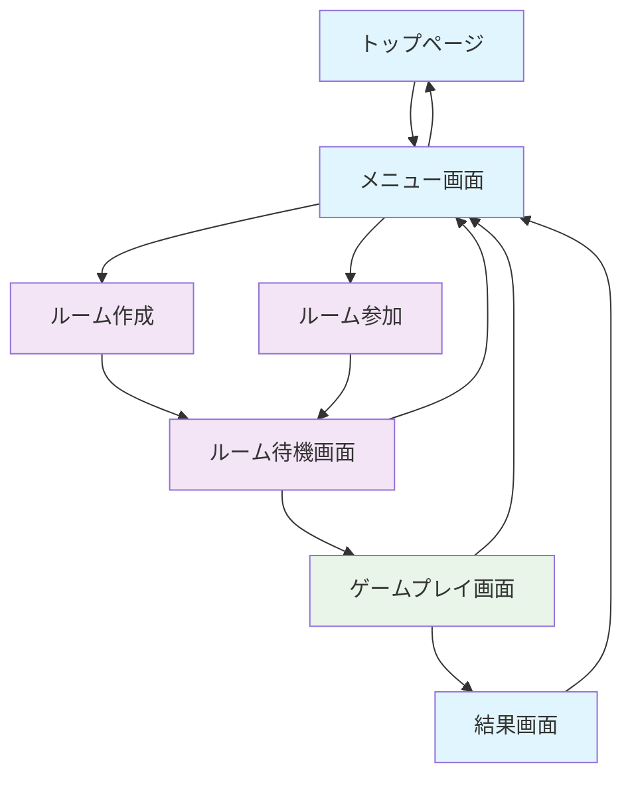

# 画面遷移図
## TYPE 2 LIVE - ITタイピングゲーム

### 画面遷移フロー

---

### 各画面の詳細仕様

#### 1. トップページ
**画面ID**: `TOP001`
**役割**: ゲームの最初の画面、ゲーム紹介とニックネーム設定

**画面要素**:
- ゲームタイトル「TYPE 2 LIVE」
- ゲーム説明文・ルール説明
- ニックネーム入力フィールド
  - プレースホルダー「ニックネームを入力してください」
  - 文字数制限表示（例：1-10文字）
- 「はじめる」ボタン
- 利用規約リンク（必要に応じて）

**遷移条件**:
- 「はじめる」クリック → メニュー画面（バリデーション通過後）

**バリデーション**:
- 未入力 → エラーメッセージ表示
- 文字数制限オーバー → エラーメッセージ表示  
- 特殊文字・記号 → エラーメッセージ表示（必要に応じて）

---

#### 2. メニュー画面
**画面ID**: `MENU001`
**役割**: ルーム作成・参加の選択、ニックネーム表示

**画面要素**:
- 「こんにちは、{ニックネーム}さん！」表示
- 「ルームを作る」ボタン
- 「ルームに参加する」ボタン
- ニックネーム変更ボタン（小さめ）

**遷移条件**:
- 「ルームを作る」クリック → ルーム作成画面
- 「ルームに参加する」クリック → ルーム参加画面
- ニックネーム変更クリック → トップページ（ニックネーム入力）

---

#### 3. ルーム作成画面
**画面ID**: `CREATE001`
**役割**: ホストがゲームルームを作成

**画面要素**:
- あいことば入力フィールド（例：hoge123）
- ゲーム設定
  - 制限時間設定（デフォルト：5分）
  - 最大参加人数設定（デフォルト：4人）
- 「ルーム作成」ボタン
- 「戻る」ボタン

**遷移条件**:
- 「ルーム作成」クリック → ルーム待機画面
- 「戻る」クリック → メニュー画面

---

#### 4. ルーム参加画面
**画面ID**: `JOIN001`
**役割**: 参加者がルームに参加

**画面要素**:
- あいことば入力フィールド
- 「参加する」ボタン
- 「戻る」ボタン
- エラーメッセージ表示エリア（バリデーション用）

**遷移条件**:
- 「参加する」クリック → ルーム待機画面（フォームでバリデーション）
- 「戻る」クリック → メニュー画面

**バリデーション**:
- あいことば未入力 → エラーメッセージ表示
- ルーム不存在 → エラーメッセージ表示
- ルーム満員 → エラーメッセージ表示

---

#### 5. ルーム待機画面
**画面ID**: `ROOM001`
**役割**: ゲーム開始前の待機、参加者管理

**画面要素**:
- ルーム情報表示
  - あいことば表示
  - ルーム設定表示
- 参加者一覧
  - ニックネーム表示
  - 参加者数/最大人数表示
  - ホスト表示（王冠アイコンなど）
- 「ゲーム開始」ボタン（ホストのみ表示、参加者2人以上で有効）
- 「ルームを出る」ボタン

**遷移条件**:
- 「ゲーム開始」クリック（ホストのみ）→ ゲームプレイ画面
- 「ルームを出る」クリック → メニュー画面
- 参加者の入退室 → リアルタイム更新

---

#### 6. ゲームプレイ画面
**画面ID**: `GAME001`
**役割**: メインゲーム画面

**画面要素**:
- **制約表示エリア**
  - 現在の制約条件表示
  - 制約係数表示
- **タイピング入力エリア**
  - 入力フィールド
  - 入力中文字のリアルタイム表示
  - 正解/不正解の視覚的フィードバック
- **得点・順位表示エリア**
  - 自分の得点
  - 現在の順位
  - プレイヤー順位表（ニックネーム + 得点、リアルタイム更新）
- **コンボ表示エリア**
  - 現在のコンボ数
  - コンボエフェクト
- **ゲーム情報エリア**
  - 残り時間表示
  - 「パス」ボタン（クールダウン表示付き）
- **ゲーム終了ボタン**（途中退出用）

**遷移条件**:
- 制限時間終了 → 結果画面
- 「ゲーム終了」クリック → メニュー画面（確認ダイアログ付き）

---

#### 7. 結果画面
**画面ID**: `RESULT001`
**役割**: ゲーム結果の表示

**画面要素**:
- **最終順位表示**
  - 各プレイヤーの最終順位（ニックネーム表示）
  - 最終得点
  - 入力した単語数
  - 最高コンボ数
- **勝者の表示**
  - 1位プレイヤーのハイライト表示（ニックネーム）
- **統計情報**
  - 自分の詳細統計
  - 正解率
  - 平均得点/単語
- **アクションボタン**
  - 「もう一度遊ぶ」ボタン
  - 「メニューに戻る」ボタン

**遷移条件**:
- 「もう一度遊ぶ」クリック → ルーム作成画面
- 「メニューに戻る」クリック → メニュー画面

---

### 共通機能

#### レスポンシブ対応
- PC、タブレット、スマートフォンでの表示最適化
- タッチデバイスでの操作性確保

#### アクセシビリティ
- キーボード操作のみでの完全操作対応
- フォーカス管理
- 適切なARIAラベル設定

#### リアルタイム更新
- Socket.ioによるリアルタイム通信
- 参加者の入退室
- ゲーム中の得点・順位更新
- コンボ・制約の即座な反映

---

### 技術実装上の考慮事項

#### 状態管理
- フロントエンド: Jotai による状態管理
- リアルタイム状態: Socket.io + Jotai の組み合わせ

#### ルーティング
- Next.js App Router使用
- 各画面は独立したページコンポーネント

#### エラーハンドリング
- ネットワークエラー
- Socket切断時の処理
- 不正な画面遷移の防止

#### パフォーマンス最適化
- タイピング入力の100ms以内レスポンス
- リアルタイム更新の500ms以内反映
- 適切なコンポーネントの memo化
