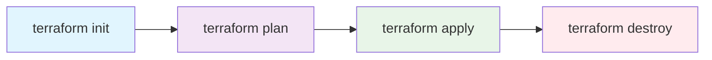

# Terraform 基礎学習ガイド
## インフラストラクチャーコード（IaC）の基本

### Terraformとは？
TerraformはHashiCorp社が開発したIaC（Infrastructure as Code）ツールルビィ！
インフラをコードで管理して、宣言的にリソースを作成・管理できるツールなのルビィ～

---

## 🌟 Terraformの特徴

### 1. 宣言的な記述
「何を作りたいか」を記述するだけで、「どうやって作るか」は自動で判断してくれるルビィ！

```hcl
# こう書くだけで...
resource "aws_instance" "web" {
  ami           = "ami-12345678"
  instance_type = "t2.micro"
}
```

### 2. マルチクラウド対応
AWS、Azure、GCP、その他多数のプロバイダーに対応しているルビィ！

```hcl
# AWS
provider "aws" {
  region = "ap-northeast-1"
}

# Azure
provider "azurerm" {
  features {}
}

# GCP
provider "google" {
  project = "my-project"
  region  = "asia-northeast1"
}
```

### 3. 状態管理
実際のインフラの状態を`.tfstate`ファイルで管理するルビィ！

### 4. プランニング機能
実行前に「何が変更されるか」を確認できるルビィ～

---

## 🛠️ 基本的な使い方

### Terraformのワークフロー



#### 1. `terraform init`
- プロジェクトの初期化
- プロバイダーのダウンロード
- バックエンドの初期化

```bash
terraform init
```

#### 2. `terraform plan`
- 実行計画の作成
- 変更内容の確認
- **実際のリソースには影響しない**

```bash
terraform plan
```

#### 3. `terraform apply`
- 実際にリソースを作成・変更
- プランの実行

```bash
terraform apply
```

#### 4. `terraform destroy`
- 管理下のリソースを削除

```bash
terraform destroy
```

---

## 📝 基本的な記法（HCL）

### リソース定義
```hcl
resource "リソースタイプ" "リソース名" {
  # 設定項目
  attribute1 = "value1"
  attribute2 = "value2"
}
```

### 例：EC2インスタンス
```hcl
resource "aws_instance" "web_server" {
  ami           = "ami-12345678"
  instance_type = "t2.micro"
  
  tags = {
    Name = "WebServer"
    Environment = "Production"
  }
}
```

### 変数の定義と使用
```hcl
# 変数定義
variable "instance_type" {
  description = "EC2インスタンスタイプ"
  type        = string
  default     = "t2.micro"
}

# 変数使用
resource "aws_instance" "web" {
  ami           = "ami-12345678"
  instance_type = var.instance_type
}
```

### データソース
既存リソースの情報を取得するルビィ！

```hcl
# 最新のAmazon Linux AMIを取得
data "aws_ami" "amazon_linux" {
  most_recent = true
  owners      = ["amazon"]
  
  filter {
    name   = "name"
    values = ["amzn2-ami-hvm-*-x86_64-gp2"]
  }
}

# データソースを使用
resource "aws_instance" "web" {
  ami           = data.aws_ami.amazon_linux.id
  instance_type = "t2.micro"
}
```

### 出力値
```hcl
output "instance_ip" {
  description = "EC2インスタンスのパブリックIP"
  value       = aws_instance.web.public_ip
}
```

---

## 🔧 設定ファイルの構成

### 基本的なファイル構成
```
project/
├── main.tf          # メインの設定
├── variables.tf     # 変数定義
├── outputs.tf       # 出力値定義
├── providers.tf     # プロバイダー設定
├── terraform.tfvars # 変数の値
└── .terraform/      # Terraformの内部ファイル
```

### main.tf の例
```hcl
# プロバイダー設定
terraform {
  required_providers {
    aws = {
      source  = "hashicorp/aws"
      version = "~> 5.0"
    }
  }
}

provider "aws" {
  region = var.aws_region
}

# VPC作成
resource "aws_vpc" "main" {
  cidr_block           = var.vpc_cidr
  enable_dns_hostnames = true
  enable_dns_support   = true
  
  tags = {
    Name = "${var.project_name}-vpc"
  }
}

# サブネット作成
resource "aws_subnet" "public" {
  vpc_id                  = aws_vpc.main.id
  cidr_block              = var.public_subnet_cidr
  availability_zone       = "${var.aws_region}a"
  map_public_ip_on_launch = true
  
  tags = {
    Name = "${var.project_name}-public-subnet"
  }
}
```

### variables.tf の例
```hcl
variable "aws_region" {
  description = "AWSのリージョン"
  type        = string
  default     = "ap-northeast-1"
}

variable "project_name" {
  description = "プロジェクト名"
  type        = string
}

variable "vpc_cidr" {
  description = "VPCのCIDRブロック"
  type        = string
  default     = "10.0.0.0/16"
}

variable "public_subnet_cidr" {
  description = "パブリックサブネットのCIDRブロック"
  type        = string
  default     = "10.0.1.0/24"
}
```

### terraform.tfvars の例
```hcl
project_name = "my-project"
aws_region   = "ap-northeast-1"
vpc_cidr     = "10.0.0.0/16"
```

---

## 🎯 重要な概念

### 1. ステートファイル（State）
Terraformが管理するリソースの現在の状態を記録するファイルルビィ！

```bash
# ステート確認
terraform show

# ステート一覧
terraform state list

# ステートから削除（実際のリソースは残る）
terraform state rm aws_instance.web
```

### 2. リモートステート
チーム開発では、ステートファイルをS3などに保存するルビィ！

```hcl
terraform {
  backend "s3" {
    bucket = "my-terraform-state"
    key    = "project/terraform.tfstate"
    region = "ap-northeast-1"
  }
}
```

### 3. モジュール
再利用可能なTerraformコードのまとまりルビィ！

```hcl
# モジュール使用
module "vpc" {
  source = "./modules/vpc"
  
  project_name = var.project_name
  vpc_cidr     = var.vpc_cidr
}
```

### 4. プロバイダー
AWSやAzureなどのAPIを呼び出すためのプラグインルビィ！

```hcl
terraform {
  required_providers {
    aws = {
      source  = "hashicorp/aws"
      version = "~> 5.0"
    }
  }
}
```

---

## 🚀 実践的な例

### Webアプリケーション用インフラ
```hcl
# VPC
resource "aws_vpc" "main" {
  cidr_block           = "10.0.0.0/16"
  enable_dns_hostnames = true
  enable_dns_support   = true
  
  tags = {
    Name = "webapp-vpc"
  }
}

# インターネットゲートウェイ
resource "aws_internet_gateway" "main" {
  vpc_id = aws_vpc.main.id
  
  tags = {
    Name = "webapp-igw"
  }
}

# パブリックサブネット
resource "aws_subnet" "public" {
  vpc_id                  = aws_vpc.main.id
  cidr_block              = "10.0.1.0/24"
  availability_zone       = "ap-northeast-1a"
  map_public_ip_on_launch = true
  
  tags = {
    Name = "webapp-public-subnet"
  }
}

# ルートテーブル
resource "aws_route_table" "public" {
  vpc_id = aws_vpc.main.id
  
  route {
    cidr_block = "0.0.0.0/0"
    gateway_id = aws_internet_gateway.main.id
  }
  
  tags = {
    Name = "webapp-public-rt"
  }
}

# ルートテーブル関連付け
resource "aws_route_table_association" "public" {
  subnet_id      = aws_subnet.public.id
  route_table_id = aws_route_table.public.id
}

# セキュリティグループ
resource "aws_security_group" "web" {
  name        = "webapp-sg"
  description = "Security group for web application"
  vpc_id      = aws_vpc.main.id
  
  ingress {
    from_port   = 80
    to_port     = 80
    protocol    = "tcp"
    cidr_blocks = ["0.0.0.0/0"]
  }
  
  ingress {
    from_port   = 22
    to_port     = 22
    protocol    = "tcp"
    cidr_blocks = ["0.0.0.0/0"]
  }
  
  egress {
    from_port   = 0
    to_port     = 0
    protocol    = "-1"
    cidr_blocks = ["0.0.0.0/0"]
  }
  
  tags = {
    Name = "webapp-sg"
  }
}

# EC2インスタンス
resource "aws_instance" "web" {
  ami                    = data.aws_ami.amazon_linux.id
  instance_type          = "t2.micro"
  subnet_id              = aws_subnet.public.id
  vpc_security_group_ids = [aws_security_group.web.id]
  
  user_data = <<-EOF
              #!/bin/bash
              yum update -y
              yum install -y httpd
              systemctl start httpd
              systemctl enable httpd
              echo "<h1>Hello from Terraform!</h1>" > /var/www/html/index.html
              EOF
  
  tags = {
    Name = "webapp-server"
  }
}

# 最新のAmazon Linux AMI取得
data "aws_ami" "amazon_linux" {
  most_recent = true
  owners      = ["amazon"]
  
  filter {
    name   = "name"
    values = ["amzn2-ami-hvm-*-x86_64-gp2"]
  }
}

# 出力
output "web_server_ip" {
  description = "WebサーバーのパブリックIP"
  value       = aws_instance.web.public_ip
}

output "web_server_url" {
  description = "WebサーバーのURL"
  value       = "http://${aws_instance.web.public_ip}"
}
```

---

## 🔍 デバッグとトラブルシューティング

### ログレベル設定
```bash
# 詳細ログ出力
export TF_LOG=DEBUG
terraform apply

# ログファイル出力
export TF_LOG_PATH=./terraform.log
terraform apply
```

### よくあるエラーと対処法

#### 1. プロバイダー認証エラー
```bash
# AWS認証情報設定
aws configure

# または環境変数設定
export AWS_ACCESS_KEY_ID="your-access-key"
export AWS_SECRET_ACCESS_KEY="your-secret-key"
```

#### 2. ステートロックエラー
```bash
# ロック強制解除（注意して使用）
terraform force-unlock LOCK_ID
```

#### 3. リソース衝突エラー
```bash
# 既存リソースをインポート
terraform import aws_instance.web i-1234567890abcdef0
```

---

## 📚 ベストプラクティス

### 1. ファイル構成
- 機能別にファイルを分割
- 変数と出力は別ファイル
- 環境別に管理

### 2. 命名規則
- 一貫性のある命名
- 環境やプロジェクト名を含める
- スネークケース使用

### 3. セキュリティ
- 機密情報は変数で管理
- ステートファイルの暗号化
- 最小権限の原則

### 4. バージョン管理
- プロバイダーバージョン固定
- Terraformバージョン指定
- Git管理

---

## 🌱 次のステップ

### 初級
- [x] 基本的なリソース作成
- [x] 変数と出力の使用
- [x] 基本的なワークフロー

### 中級
- [ ] モジュールの作成・使用
- [ ] リモートステート管理
- [ ] 条件分岐・ループ

### 上級
- [ ] 複雑なモジュール設計
- [ ] CI/CDパイプライン統合
- [ ] カスタムプロバイダー

---

## 🔗 参考リンク

- [Terraform公式ドキュメント](https://www.terraform.io/docs)
- [AWS Provider Documentation](https://registry.terraform.io/providers/hashicorp/aws/latest/docs)
- [Terraform Best Practices](https://www.terraform-best-practices.com/)
- [HashiCorp Learn](https://learn.hashicorp.com/terraform)

---

がんばルビィ！このガイドでTerraformの基本をマスターできるルビィ～✨
一歩ずつ学習していけば、きっとインフラエンジニアとして成長できるルビィ！
